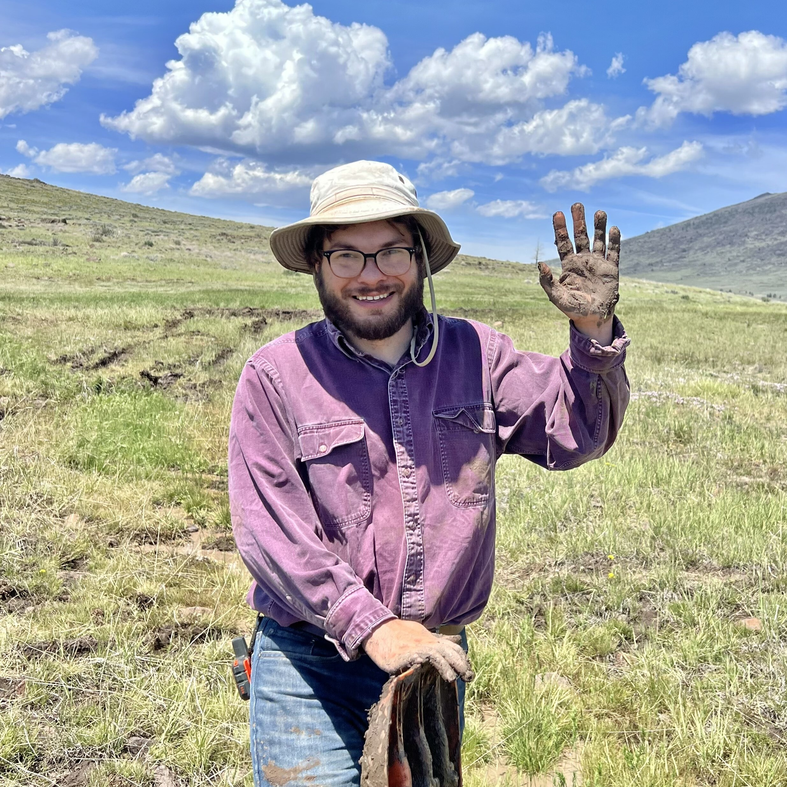

```{r logo, eval = T, echo = FALSE, fig.height = 2, fig.width = 20}

library(icon)

```
\

# `r fa("tint", color = "gray")` AquatiQuE Lab - UNC Greensboro

---

We study **Aquati**c ecosystems using skills of **Qu**antitative **E**cology. We are particularly excited about combining theoretical, statistical, and field-based approaches to address fundamental and applied questions in spatial ecology. Looking for opportunities? Visit [`r icon::fa("users")` Join](join.html) for available options. Current key topics in our group include the following:

<div class="clearfix">


### Branching complexity and biodiversity in rivers

Rivers recurrently join to form a fractal branching network, in which geometric properties (e.g., branching patterns) remain similar across spatial scales. We are interested in how this “scale-invariant” complexity drives ecological systems. We tackle this question with mathematical models and big-data synthesis. Core part of this project has recently been funded by NSF ([link](https://nsf.gov/awardsearch/showAward?AWD_ID=2015634&HistoricalAwards=false)). Photo credit <a href="https://pixabay.com/ja/?utm_source=link-attribution&amp;utm_medium=referral&amp;utm_campaign=image&amp;utm_content=1031760">Pixabay</a>
</div>
\
<div class="clearfix">


### Non-random dispersal

Dispersal is a fundamental process that mediates disease spread, metapopulation/metacommunity dynamics, and food webs. Although dispersal is often assumed to be a “stochastic” event in population/community ecology, behavioral ecologists have long recognized that dispersal is triggered by internal (e.g., body size) and/or external (e.g., disturbance) factors. We are interested in integrating behavioral aspects of dispersal into population and community ecology. Photo: Masu salmon *Oncorhynchus masou masou*
</div>
\
<div class="clearfix">


### Cross-system trophic interactions

Ecosystems are not a stand-alone entity; rather, they are connected through resource flux across ecosystems. We are interested in how aquatic and terrestrial food webs are connected through animal migration (e.g., the emergence of aquatic insects), and how food web interactions mediate transfer of energy across ecosystems. Photo: Ground beetle *Brachinus stenoderus* eating aquatic insects emerging from the river
</div>
\
<div class="clearfix">


### Applications of spatial theory to wetland conservation

We use metapopulation/metacommunity theories to identify important areas to maintain regional population persistence of wetland species. We are currently working on the bog turtle and Topeka shiner, both of which are highly threatened by human activities. Photo credit: Melanie Stadler
</div>

<!--chapter:end:index.Rmd-->

---
title: "GitHub"
date: Latest update - `r format(Sys.time(), '%d %B, %Y')`
output:
  html_document:
    toc: true
    toc_float: true
    number_sections: true
    df_print: paged
---

```{r setup, include = FALSE}

knitr::opts_chunk$set(fig.width = 5, fig.height = 5)

```


---

# GETTING STARTED

---

## WHY GITHUB?

Why GitHub? There are two reasons.

- **It keeps your codes (and other materials too) on an online repository**. This feature enables you to share your codes seamlessly with others and to store your codes at a secured place.
- **It tracks changes in the codes**. Tracking changes is extremely important to avoid unintended errors in your codes. This feature also help avoid creating redundant files.


## GitHub account
The first step is to create a GitHub account. Go to [GitHub](https://github.com/) and create your account (free!). **Give some thoughts on your user name**. My advice is the following:

- Use lowercase only. Most programming languages do not distinguish upper- and lowercase in programming, creating problems when identifying files. GitHub is case-sensitive anyway, but it would be better to follow this convention.
- Include your name to make it easy to find you on GitHub.


## Install Git
You will need Git to commit and push.

- **Windows**: Install Git from [here](https://gitforwindows.org/). While installing Git, you will be asked about “Adjusting your PATH environment”. Choose “Git from the command line and also from 3rd-party software” if it is not selected.

- **Mac**: Follow the instruction [here](https://happygitwithr.com/install-git.html).


## Connect Git with Rstudio

Once you installed Git, check the following on your R studio:

- If you see a git pane on the upper right panel, you are good to go.
- Do `Create Project` > `New Directory` > `New Project`. If you see a check box `Create a git repository`, you are good to go.

If you can't find the above, do the following: `Tools` in the menu bar > `Terminal` > `New Terminal`, and type `where git` in the terminal. This will tell you where git executable is located in your computer. Then, go to `Tools` in the menu bar > `Global Options` > `Git/SVN`. You will see *Git executable* in the box, where you can specify the location of git executable.


## Tell yourself to Git

You can tell who you are to Git using the following script (R console). Make sure to use your github account name for `user.name` and to use the associate email for `user.email`.

```{r, eval=FALSE}
## install.packages("usethis") # install 'usethis' package if you have not done

library(usethis)
use_git_config(user.name = "your_github_account", user.email = "youemail@example.org")
```


## Git client

R studio works seamlessly with Git or GitHub, but it is helpful to use a *Git client* as it provides visual aids. There are choices for a *Git client* (see options [here](https://happygitwithr.com/git-client.html)) but I will use *GitHub Desktop* (available [here](https://desktop.github.com/)) for our exercise. Install GitHub Desktop onto you computer.


---

# Create a Git repo

---

## Create an R Project in R Studio

There are several ways to create a GitHub repository. The simplest approach (I believe) is to create an R project in your local computer, then publish it to GitHub via GitHub Desktop. Let's create an R project: `File` in the menu bar > `New Project` > `New Directory` > `New Project`. At this point, you should see the following pop-up:


**Make sure you checked `Create a git repository`!** Otherwise, the created directory will not be recognized by Git (i.e., you cannot link your local directory with the corresponding online repository). Once you created the project (name as `test` for this exercise), open the project through R Studio and make a random R script file and save it (name as `test_script.R`). For example:

```{r, eval = FALSE}

## produce 100 random numbers that follows a normal distribution
x <- rnorm(100, mean = 0, sd = 1)

## estimate mean
mean(x)

## estimate SD
sd(x)

```


## Connect with GitHub Desktop

Open GitHub Desktop App. You should see the following GUI:


Hit `current repository` (top left) and `Add` > `Add existing repository`.


GitHub Desktop will prompt you to enter a local path to your Git repository. Browse and select your directory of the R Project - the local Git repository will show up in the list of repositories in GitHub Desktop (**NOTE**: at this stage, this repository/directory exists only at your local computer, not published to the GitHub!).

## Commit

Your file (R script or else) is saved onto your local directory, but it has not been recorded in Git as a change history. To record your change history in Git, click the directory on GitHub Desktop, and you will see the following:


In the left bar, there is a list of files added to the directory. We want to make a **commit** to record a history of file addition/edits/deletion. There are checkboxes next to each of the new files. If this box is checked, you are going to commit changes to Git. Once you selected the files you want to make a commit, go to the bottom left of the window. There is a small box saying `summary (required)`. This is the place where you can put any title that describes what you did in this commit. For example, I would write `initial commit` for this exercise - from the second commit, you should put an informative commit message so you can track changes when needed. You can google recommendations for how to write commit titles/descriptions. Then hit `commit to master`. Now, changes to the selected files have been recorded in Git.


## Push

Remember, your changes are recorded in your local computer but not published in your online repository! To reflect local changes to the online repository, you will need to **push** it via GitHub Desktop. Once you do a **commit**, GitHub Desktop will ask you whether you want to push it to an online repository. If this is the first push, there is no corresponding repository on GitHub, so GitHub Desktop will ask you if you want to publish it on GitHub (**NOTE**: although it says 'publish', your repository is still inaccessible from others - you have to change setting online to make it public):


If you are comfortable with the changes you made, push it!


## Edits to existing files

We went through how we get things uploaded onto GitHub, but what happens if we make changes to existing files? To see this, let's make a minor change to your script. We have created a file `test_script.R`:

```{r, eval = FALSE}

## produce 100 random numbers that follows a normal distribution
x <- rnorm(100, mean = 0, sd = 1)

## estimate mean
mean(x)

## estimate SD
sd(x)

```

Edit this:

```{r, eval = FALSE}

## produce 100 random numbers that follows a normal distribution
x <- rnorm(100, mean = 0, sd = 1)

## estimate mean
median(x)

## estimate SD
var(x)

```

After making this change, go to GitHub Desktop again. GitHub Desktop automatically detects the difference between the new and old files and shows which part of the script has been edited! This helps coding quite a bit:


<!--chapter:end:github.Rmd-->

---
title: "Join"
---

### Undergraduate students

Students who are interested in freshwater ecology/spatial ecology/quantitative ecology are encouraged to contact me (a_terui at uncg.edu). Opportunities exist to learn field research skills and statistical modeling with R.

### Graduate students

#### Ph.D position
Aquatic ecology lab at UNCG is currently looking for a Ph.D student starting Fall 2021. The student will work on a project investigating fish movement and demographic patterns in a small stream. The student will perform data collection in the field and develop statistical models estimating key ecological parameters, such as movement distance and survival. Also, there is a possibility of developing research projects tailored to student's interests. The project is at the interface of behavioral and population ecology, and students who are particularly interested in synthesizing these research fields are encouraged to apply.

#### MS position
Aquatic ecology lab at UNCG is currently looking for a master student starting Fall 2021. The student will work on the statistical modelling of discharge variation in relation to land use and geometries of river networks. The project leverages the public database of discharge and land use. This is part of the project exploring drivers of food chain length in rivers and the student is expected to work collaboratively with current lab members. The student is expected to have a solid understanding of ecology, environmental science, hydrology or related fields. Advanced skills in R and GIS are a big plus.

If interested in either of the above positions, please contact me (a_terui at uncg.edu) with (1) your CV, (2) a one-page research statement describing your previous research experiences and interests, and (3) the names and contacts of three referees. Review of applications begins immediately. The departmental deadline for submitting the application to the graduate studies is January 15, 2021 for Ph.D and April 1, 2021 for MS. If the student is accepted into the graduate program, there is the possibility for financial support in the form of teaching or research assistantships. For details, please visit [here](https://biology.uncg.edu/graduate/apply/)

### Postdocs

I welcome inquiries about postdoctoral projects in our research group. If our research program is a good fit for your interests, please email me (a_terui at uncg.edu) with your CV and a short summary of your research interests (1-2 pages). We can develop collaborative projects through postdoctoral fellowships, such as [Smith Fellowship](https://conbio.org/mini-sites/smith-fellows) and JSPS Postdoctoral Fellowship.

<!--chapter:end:join.Rmd-->

---
title: "Helpful link"
---

### R

- [R for Data Science](https://r4ds.had.co.nz/)
- [R Markdown: The Definitive Guide](https://bookdown.org/yihui/rmarkdown/)
- [Creating websites in R](https://www.emilyzabor.com/tutorials/rmarkdown_websites_tutorial.html)

### Bayesian modelling

- [Introduction to WinBUGS for Ecologists](https://www.amazon.com/Introduction-WinBUGS-Ecologists-Bayesian-regression/dp/0123786053/ref=sr_1_1?dchild=1&keywords=Introduction+to+WinBUGS+for+Ecologists&qid=1597460036&s=books&sr=1-1)
- [Bayesian Population Analysis using WinBUGS: A Hierarchical Perspective](https://www.amazon.com/Bayesian-Population-Analysis-using-WinBUGS/dp/0123870208)
- [Data Analysis Using Regression and Multilevel/Hierarchical Models](https://www.amazon.com/Analysis-Regression-Multilevel-Hierarchical-2006-12-18/dp/B01FIYAH00)
- [The BUGS Book](https://www.amazon.com/BUGS-Chapman-Texts-Statistical-Science/dp/1584888490)

### GIS

- [R as GIS for Economists](https://tmieno2.github.io/R-as-GIS-for-Economists/)

<!--chapter:end:link.Rmd-->

---
title: "Publication"
date: Latest update - `r format(Sys.time(), '%d %B, %Y')`
output:
  html_document:
    toc: true
    toc_depth: 4
    toc_float: true
---

\

### In Review

- **Terui A** et al. Non-random dispersal in sympatric stream fishes: influences of natural disturbance and body size

### Published

#### 2021

- Comte et al. (2021) RivFishTIME: A global database of fish time-series to study global change ecology in riverine systems. Global Ecology and Biogeography 30: 38-50.

#### 2020

- **Terui A** (2020) Modeling dispersal using mark1.recapture data: a comparison of dispersal models. Ecological Research 35: 686-699.
- Nakamura F, Watanabe Y, Negishi JN, Akasaka T, Yabuhara Y, **Terui A**, Yamanaka S, Konno M (2020) Restoration of the shifting mosaic of floodplain forests under a flow regime altered by a dam. Ecological Engineering 157: 105974.

#### 2019

- **Terui A**, Finlay JC, Hansen AT, Kozarek JL. (2019) Quantifying cryptic function loss during community disassembly. Journal of Applied Ecology 56: 2710-2722
- Senzaki M, **Terui A**, Sato F, Fukuda Y, Kataoka Y, Watanuki Y (2019) Long-term declines in common breeding seabirds in Japan. Bird Conservation International 1-13.
- **Terui A**, Nishijima S (2019) Spatial disturbance synchrony alters the association of food chain length and ecosystem size. Ecological Research 34: 864-871
- Negishi JN, **Terui A**, Badrun N, Miura K, Oiso T, Sumitomo K, Kyuka T, Yonemoto M, Nakamura F (2019) High resilience of aquatic community to a 100-yr flood in a gravel-bed river. Landscape and Ecological Engineering 15: 143-154.

#### 2018

- Ishiyama N, Ryo M, Kataoka T, Nagayama S, Sueyoshi M, **Terui A**, Mori T, Akasaka T, Nakamura F. (2018) Predicting the ecological impacts of large dam removals on a river network based on habitat network structure and flow regimes. Conservation Biology 32: 1403-1413.
- **Terui A**, Ishiyama N, Urabe H, Ono S, Finlay JC, Nakamura F. (2018) Metapopulation stability in branching river networks. Proceedings of the National Academy of Sciences 115: E5963-E5969.
- Hanioka M, Yamaura Y, Yamanaka S, Senzaki M, Kawamura K, **Terui A**, Nakamura F. (2018) How much abandoned farmland is required to harbor comparable species richness and abundance of bird communities in wetland? Hierarchical community model suggests the importance of habitat and landscape variables. Biodiversity and Conservation 27: 1831-1848.
- **Terui A**, Negishi JN, Watanabe N, Nakamura F. (2018) Stream resource gradients drive consumption rates of supplemental prey in the adjacent riparian zone. Ecosystems 21: 772-781.

#### 2017

- Kakinuma K, **Terui A**, Sasaki T, Koyama A, Jamsran U, Okuro T, Takeuchi K.. (2017) Detection of vegetation trends under highly variable environment after grazing exclusion in Mongolia. Journal of Vegetation Science 28: 965-974.
- **Terui A**, Ooue K, Urabe H, Nakamura F. (2017) Parasite infection induces size-dependent host dispersal: consequences for parasite persistence. Proceedings of the Royal Society B: Biological Sciences 284: 20171491.
- Ooue K, **Terui A**, Urabe H, Nakamura F. (2017) A delayed effect of the aquatic parasite Margaritifera laevis on the growth of the salmonid host fish Oncorhynchus masou masou. Limnology 18: 345-351.
- **Terui A**, Akasaka T, Negishi JN, Uemura F, Nakamura F. (2017) Species-specific use of allochthonous resources by ground beetles (Carabidae) at a river-land interface. Ecological Research 32: 27-35.
- **Terui A** and Miyazaki Y. (2017) Combined effects of immigration potential and habitat quality on diadromous fishes. Limnology 18: 121-129.

#### 2016

- **Terui A** and Miyazaki Y. (2016) Three ecological factors influencing riverine fish diversity in the Shubuto River system, Japan: habitat capacity, habitat heterogeneity and immigration. Limnology 17:143-149.
- Miyazaki Y and **Terui A**. (2016) Difference in habitat use between the two related goby species of Gymnogobius opperiens and G. urotaenia: a case study in the Shubuto River System, Hokkaido, Japan. Ichthyological research 63: 317-323.
- Miyazaki Y and **Terui A**. (2016) Temporal dynamics of fluvial fish composition caused by marine amphidromous species in the Shubuto River, southwestern Hokkaido, Japan. Ichtyological Research 63: 173-179.

#### 2015

- **Terui A**, Miyazaki Y, Yoshioka A, Matsuzaki SS. (2015) A cryptic Allee effect: spatial contexts mask an existing fitness-density relationship. Royal Society Open Science 2: 150034.
- **Terui A** and Miyazaki Y. (2015) A “parasite-tag” approach reveals long-distance dispersal of the riverine mussel Margaritifera laevis by its host fish. Hydrobiologia 760: 189-196.

#### 2014

- **Terui A**, Miyazaki Y, Yoshioka A, Kaifu K, Matsuzaki SS, Washitani I. (2014) Asymmetric dispersal structures a riverine metapopulation of the freshwater pearl mussel Margaritifera laevis. Ecology and Evolution 4: 3004-3014.
- **Terui A**, Miyazaki Y, Yoshioka A, Kadoya T, Jopp F, Washitani I. (2014) Dispersal of larvae of Margaritifera laevis by its host fish. Freshwater Science 13: 112-123.

#### 2013

- Miyazaki Y, **Terui A**, Senou H, Washitani I. (2013) Illustrated checklist of fishes from the Shubuto River System, southwestern Hokkaido, Japan. Check List 9: 63-72.
- Miyazaki Y, **Terui A**, Yoshioka A, Kaifu K, Washitani I. (2013) Fish species composition of temporary small lentic habitats in the floodplains of the Shubuto River System: Factors affecting species richness and suggestions for conservation and restoration. Japanese Journal of Conservation Ecology 18: 55-68. (in Japanese)

#### 2012

- Kubo S, **Terui A**, Nishihiro J, Washitani I. (2012) Impact of alien species on the distribution of native submerged macrophytes in small rivers and agricultural canals around Lake Mikata. Japanese Journal of Conservation Ecology 17: 165-173. (in Japanese)

#### 2011

- **Terui A**, Matsuzaki SS, Kodama K, Tada M, Washitani I. (2011) Factors affecting the local occurrence of the near-threatened bitterling (Tanakia lanceolata) in agricultural canal networks: strong attachment to its potential host mussels. Hydrobiologia 675: 19-28.
- Matsuzaki SS, **Terui A**, Kodama K, Tada M, Yoshida T, Washitani I. (2011) Influence of connectivity, habitat quality and invasive species on egg and larval distributions and local abundance of crucian carp in Japanese agricultural landscapes. Biological Conservation 144: 2081-2087.
- Miyazaki Y, **Terui A**, Kubo S, Hatai N, Takahashi K, Saitoh H, Washitani I. (2011) Ecological evaluation of the conservation of fish fauna in the Shubuto River system, southwestern Hokkaido. Japanese Journal of Conservation Ecology 16: 213-219. (in Japanese)
- Matsuzaki SS, Kodama K, **Terui A**, Takeshima H, Sato T, Tominaga O, Maeda H, Tada M, Washitani I, Yoshida T.(2011) Changes in the strictly freshwater fish fauna around Lake Mikata, Fukui Prefecture, Japan, inferred from monitoring data and ecological trait information. Japanese Journal of Conservation Ecology 16: 205-212. (in Japanese)
- **Terui A**, Miyazaki Y, Matsuzaki SS, Washitani I. (2011) Population status and factors affecting local density of endangered Japanese freshwater pearl mussel Margaritifera laevis in Shubuto river basin, Hokkaido. Japanese Journal of Conservation Ecology 16: 149-157. (in Japanese)

#### 2010

- Matsuzaki SS, Kodama K, Takeshima H, **Terui A**, Masui M, Yoshida T, Washitani I. (2010) Invasion of bluegill in Lake Mikata. Japanese Journal of Ichthyology 57: 87-89. (in Japanese)

<!--chapter:end:pubs.Rmd-->

---
title: "R BASICS"
date: Latest update - `r format(Sys.time(), '%d %B, %Y')`
output:
  html_document:
    toc: true
    toc_float: true
    number_sections: true
    df_print: paged
---

```{r setup, include = FALSE}

knitr::opts_chunk$set(fig.width = 5, fig.height = 5)

```

---

# GETTING STARTED

---

## Install R and R Studio

R and R Studio can be installed from the following websites:

- [R](https://www.r-project.org/) (you can choose any CRAN mirror to download)
- [R Studio](https://rStudio.com/products/rStudio/download/)

While R is stand-alone software, I strongly recommend to use it with R Studio. R Studio has many functions that help your data analysis.
\
\

## Basic Setup

### Interface


R Studio interface. The left half of the screen is **“console”** where you put your script to execute calculation/data manipulation/analysis (ignore the tab “Terminal” at this point). The right bottom shows a folder in which you are working now – i.e., **“working folder or directory”**. R does not recognize any files outside of this folder, so be sure to pick the right directory when you work in R.

### Create Project
As you proceed, numerous materials will be generated. How do we manage files? No worries, R Studio will help organize files by creating a project. To initiate the process of creating a project:

a. go to `File > New Project` on the top menu
b. select `New Directory`
c. select `New Project`

A new window pops up and prompts you to name a directory and where to put the directory in your computer. Click `Browse` to select a location for the directory. I would create a folder for R projects (e.g., `RProject`) and save project directories under this folder. Click **Create Project** once you decided directory name and location:


### Find Where You Are
Once you created a project, R Studio will take you to where the R project is located. Check the current directory using the following script:

```{r}
getwd()
```

However, when you next open R Studio, the initial location could be somewhere else. In that case, go to `File > Open Project` and open the `.Rproj` file that you just created. This will take you to the directory you are supposed to be.
\
\

## Object

### Create Object
Let’s play with R. Put the following script in your console.

```{r}
x <- c(10.1, 5.3, 8.8, 6.7, 8.2)
```

This script creates a vector of numbers composed of {10.1, 5.3, 8.8, 6.7, 8.2}. `x` is a ‘box’ where the vector information is stored, and ‘<-’ is the arrow that commands R to store {10.1, 5.3, 8.8, 6.7, 8.2} in a box `x`. `x` is referred to as an **object**. Let’s see what’s in `x`:

```{r}
x
```

R has many functions that calculate the mean, median, etc. Let’s calculate a mean and median for `x`:

```{r}
mean(x)
median(x)
```

Also, you can pick an element(s) as you wish. Numbers in brackets `[]` specifies the numbered ID of each element. In the above example, element `x[3]` is `8.8`. You can extract this information with the following script:

```{r}
x[3]
```

You can also choose multiple elements simultaneously. For example, `3:5` specifies elements starting from 3 to 5 (colon creates a sequence of numbers):

```{r}
3:5
x[3:5]
```

If you want to pick elements that are not ordered sequentially, you can use `c()` to specify multiple elements:

```{r}
c(1,4)
x[c(1,4)]
```

### Case Sensitive
Importantly, **objects are case sensitive**. Let's see what happens when you create an object `x` (lower case):

```{r}
# create an object `x` (lower case)
x <- 3

# check what's in object `x` (lower)
print(x) 
```

There is a number saved in the object `x`. Try `X` (upper case):

```{r, error = TRUE}

print(X)

```

This returns a message `Error: object 'X' not found`. This is because R distinguishes lower and upper cases. To see the difference, create the object `X`:

```{r}

# create an object `x` (upper case)
X <- 5

# check what's in object `X` (upper)
print(X) 

# check what's in object `x` (lower)
print(x) 

```

Thus, lower `x` and upper `X` can save different information.
\
\

## Arithmetic Operations

### Number

Addition

```{r}
1 + 1
121 + 123
```

Subtraction

```{r}
1 - 1 
121 - 123
```

Multiplication

```{r}
1 * 1
121 * 123
```

Division

```{r}
1 / 1
121 / 123
```

Power

```{r}
2^2
```

Square root

```{r}
sqrt(4)
4^(1/2)
```

### Object

R can handle arithmetic operations between objects. Prepare objects `x` and `y`:

```{r}

x <- 1:5
y <- 2:6

print(x)
print(y)

```

You can use objects instead of directly entering numbers. R automatically performs arithmetic operations for each element. For example, enter `y-x`:

```{r}
y - x
```

This is equivalent to:

$$
y[1] - x[1]\\
y[2] - y[2]\\
...\\
y[n] - x[n]
$$

You can save the results as another object:

```{r}
z <- y - x
print(z)
```
\
\

## R Script

In R Studio, we rarely write scripts directly in R console. This is because console **does NOT save your scripts**, so it is difficult to keep records of data manipulation and analysis. Instead, we write our scripts in an **R script**, which enables you save and organize scripts in a separate window and allows you to run scripts when you are ready.

### Create R Script

To create an **R script**:

a. go to `File > New File > R Script` (or `Ctrl + Shift + N`)
b. then, you will see a new window of R script in the left top


### Run R Script

You can run your script from the R script window. Write the following scripts:

```{r eval = F}
x <- c(10.1, 5.3, 8.8, 6.7, 8.2)
mean(x)
```

Once you write scripts in the R Script window, the tab text will turn into <span style="color: red;">red</span>.
This means this **R Script** file is edited but **unsaved**. You can save the file by `Ctrl + s` or by clicking the `floppy disk` icon on the top bar.
Writing these scripts in the R script window does not execute any calculation. To execute, select lines and `Ctrl + Enter`. Selected scripts will appear in the console and execute what you commanded:


\
\

## Compile Report

R Studio has a function to compile a report from R scripts (see also [R Markdown: The Definitive Guide](https://bookdown.org/yihui/rmarkdown/) for details). Include the following script on the top of the R script file to put your information:

```{r eval = F}
#' ---
#' title: "Report"
#' author: Your Name
#' date: Jan 16, 2020
#' output: html_document
#' ---
```

Each argument determines the following:

- `title` title of your report
- `author` this appears below the title in the compiled report
- `date` date created
- `output` output format; use `html_document`

Click on the "compile" button on the top. This creates a report from your R script:


The R Studio will start compiling your report. Here is some rules when compiling a report.

- Your script will appear in a grey box. Put `#` if you want leave a comment on the script.
- Output from your script will appear in a white box with double sharps
- Text after `#'` will show up outside a grey box (text after `#` will be regarded as Header)

For example, the following script is compiled like this:

```{r eval = F}

#' ---
#' title: "Report"
#' author: Your Name
#' date: Jan 16, 2020
#' output: html_document
#' ---

#' # Header 1.1
#' ## Header 1.2
#' ### Header 1.3
#' This appears outside boxes

# inbox comment here
x <- c(1, 2, 3, 4)
x

#' # Header 2.1
#' ## Header 2.2
#' ### Header 2.3
#' This text can be used to guide readers

# inbox comment here
y <- 1:9
y

```


\
\

## File Management

As you proceed, the number of files will increase. It is critical to learn basic rules of **how to locate and name your files in your computer**. Here are some recommendations:

- Put all the relevant files in a single folder.
  - R scripts and associated files should be saved in the project folder.
  - Create a new R project when working on different topics. Do not mix them up in a single folder.
- Avoid space and period when naming files. Instead, use underscore or hyphen.
  - Do: `script_week1.R` `script-week1.R`
  - Don't: `script week1.R`
- Use lowercase.
  - Do: `script_week1.R`
  - Don't: `Script_week1.R`
- Keep consistent.
  - For example, if your R script deals with figures, then name it `figure_XXX.R` (`XXX` identifies further details).
- Numbering will help keep your folder/directory organized.
  - `figure_temperature.R`, `figure_precipitation.R`...this will work, but the order of files may be confusing.
  - `figure01_temperature.R`, `figure02_precipitation.R`...this will order files by group (`figure`) and then numerically.
\
\

---


# DATA STRUCTURE

---

## Overview

R has 6 basic **data types**.

- character: `"aquatic"`, `"ecology"` (no order)
- factor: similar to character, but has *levels* (alphabetically ordered by default)
- numeric: `20.0` , `15.5`
- integer: `3`, `7`
- logical: `TRUE` , `FALSE`
- complex: `1+2i` (complex numbers with real and imaginary parts)

These elements form one of the following **data structures**.  

- **vector**: a series of elements. A single data type is allowed in a single vector
- **matrix**: elements organized into rows and columns. A single data type is allowed in a single matrix
- **data frame**: looks similar to a matrix, but allows different data types in different columns

\
\

## Vector
### Create Vector

Below are examples of atomic character vectors, numeric vectors, integer vectors, etc. There are many ways to create vector data. The following examples use `c()`, `:`, `seq()`, `rep()`:

```{r}

#ex.1a manually create a vector using c()
x <- c(1,3,4,8)
x

#ex.1b character
x <- c("a", "b", "c")
x

#ex.1c logical
x <- c(TRUE, FALSE, FALSE)
x

#ex.2 sequence of numbers
x <- 1:5
x

#ex.3a replicate same numbers or characters
x <- rep(2, 5) # replicate 2 five times
x

#ex.3b replicate same numbers or characters
x <- rep("a", 5) # replicate "a" five times
x

#ex.4a use seq() function
x <- seq(1, 5, by = 1)
x

#ex.4b use seq() function
x <- seq(1, 5, by = 0.1)
x

```

### Check Features

R provides many functions to examine features of vectors and other objects, for example:

- `class()` - what kind of object (data structure) is it (high-level)?
- `typeof()` - what is the object’s data type (low-level)?
- `attributes()` - does it have any metadata?
- `length()` - how long is it? What about two dimensional objects?
- `sum()` - what is the summed number of the data?
- `mean()` - what is the average number of the data?

**Numeric Vector**

```{r}

x <- c(1.2, 3.1, 4.0, 8.2)
x
class(x)
typeof(x)
length(x)
sum(x)
mean(x)

```

**Character Vector**

```{r}

y <- c("a", "b", "c")
class(y)
length(y)

```
  
### Access

**Element ID**\
Use brackets `[]` when accessing specific elements in an object.
For example, if you want to access element #2 in the vector `x`, you may specify as `x[2]`:

```{r}

x <- c(2,2,3,2,5)
x[2] # access element #2
x[c(2,4)] # access elements #2 and 4
x[2:4] # access elements #2-4

```

**Equation**\
R provides many ways to access elements that suffice specific conditions. You can use mathematical symbols to specify what you need, for example:

- `==` equal
- `>` larger than
- `>=` equal & larger than
- `<` smaller than
- `<=` equal & smaller than
- `which()` a function that returns element # that suffices the specified condition

The following examples return a logical vector indicating whether each element in x suffices the specified condition:

```{r}

# creating a vector
x <- c(2,2,3,2,5)

# ex.1a equal
x == 2

# ex.1b larger than
x > 2 

```

You can access elements that suffice the specified condition using brackets, for example:

```{r}

# ex.2a equal
x[x == 2]
# ex.2b larger than
x[x > 2]

```

Using `which()`, you can see which elements (i.e., #) matches what you need:

```{r}

# ex.3a equal
which(x == 2) # returns which elements are equal to 2
# ex.3b larger than
which(x > 2)

```

\o
\

## Matrix
### Create Matrix

Matrix is a set of elements (*single data type*) that are organized into rows and columns:

```{r}

#ex.1 cbind: combine objects by column
x <- cbind(c(1,2,3), c(4,5,6))
x

#ex.2 rbind: combine objects by row
x <- rbind(c(1,2,3), c(4,5,6))
x

#ex.3 matrix: specify elements and the number of rows (nrow) and columns (ncol)
x <- matrix(1:9, nrow = 3, ncol = 3)
x

```

### Check Features

R provides many functions to examine features of matrix data, for example:

- `class()` what kind of object (data type) is it (high-level)?
- `typeof()` what is the object’s data type (low-level)?
- `attributes()` does it have any metadata?
- `dim()` how long are rows and columns?
- `rowSums()` what is the summed number of the data for each row?
- `colSums()` what is the summed number of the data for each column?

**Integer Matrix**\

```{r}

x <- matrix(1:9, nrow = 3, ncol = 3)
x
class(x)
typeof(x)
dim(x)

```

**Character Matrix**\

```{r}

y <- matrix(c("a","b", "c", "d", "e", "f"), nrow = 3, ncol = 2)
y
class(y)
typeof(y)
dim(y)

```

### Access

When accessing matrix elements, you need to pick row(s) and/or column(s), for example:

```{r}

x <- matrix(1:9, nrow = 3, ncol = 3)
x
x[2,3] # access an element in row #2 and colum #3
x[2,] # access elements in row #2
x[c(2,3),] # access elements in rows #2 and 3
x[,c(2,3)] # access elements in columns #2 and 3

```

You can assess each element with mathematical expressions just like vectors:

```{r}

x == 2 # equal
x > 2 # larger than

```

However, care must be taken when accessing elements, as it will be automatically converted to vector data:

```{r}

x[x == 2] # equal
x[x > 2] # larger than

```

`which()` needs an additional argument to return both row and column #:

```{r}

which(x == 2, arr.ind = TRUE)
which(x > 2, arr.ind = TRUE)

```

\
\

## Data Frame

Data frame is a set of elements that are organized into rows and columns, but differ from matrix in several ways.

- it allows *multiple data types* in different columns
- each column has its *name*
- you can access columns by name (using `$`)

**Data frame is the most common data structure when manipulating ecological data**. A data set loaded from a spread sheet (we will address this later) will be automatically recognized as a data frame. Here is an example:

**Create a data frame**\
In the following example, variables `x` and `y` are organized into a single data frame `dat`. Variable are renamed when creating a data frame composed of `x` and `y`.

```{r}
# Create data frame
x <- c("Pristine", "Pristine", "Disturbed", "Disturbed", "Pristine") # Lake type
y <- c(1.2, 2.2, 10.9, 50.0, 3.0) # TSS: total suspended solids (mg/L)
dat <- data.frame(LakeType = x, TSS = y) # x is named as "LakeType" while y is named as "TSS"
dat
```

**Call column names**\
```{r}
colnames(dat) # call column names
```

**Access by columns**\
```{r}
dat$LakeType # access LakeType
dat$TSS # access TSS
```

You can access elements like a matrix as well:

```{r}

dat[,1] # access column #1
dat[1,] # access row #1
dat[c(2,4),] # access row #2 and 4

```

\
\

## Exercise

Download a <a href = "file/report01_temp.R" download>template</a> (R script file).

### Vector

a. Create three numeric vectors with length 3, 6 and 20, respectively. Each vector must be created using different functions in R.
b. Create three character vectors with length 3, 6 and 20, respectively. Each vector must be created using different functions in R.
c. Copy the following script to your R script and perform the following analysis:
  - Identify element IDs of `x` that are greater than `2.0`
  - Identify element values of `x` that are greater than `2.0`

```{r, eval = FALSE}

set.seed(1)
x <- rnorm(100)

```


### Matrix

a. Create a numeric matrix with 4 rows and 4 columns. Each column must contain identical elements.
b. Create a numeric matrix with 4 rows and 4 columns. Each row must contain identical elements.
c. Create a character matrix with 4 rows and 4 columns. Each column must contain identical elements.
d. Create a character matrix with 4 rows and 4 columns. Each row must contain identical elements.
e. Copy the following script to your R script and perform the following analysis:
  - Identify element IDs of `x` that are greater than `2.0` (**specify row and column IDs**)
  - Identify element values of `x` that are greater than `2.0` and calculate the mean.

```{r, eval = FALSE}

set.seed(1)
x <- matrix(rnorm(100), nrow = 10, ncol = 10)

```


### Data Frame

a. Create a data frame of 3 variables with 10 elements (name variables as `x`, `y` and `z`. `x` must be `character` while `y` and `z` must be `numeric`.
b. Check the data structure (higher-level) of `x`, `y` and `z`
c. Copy the following script to your R script and perform the following analysis:
  - Calculate the means of `temperature` and `abundance` for states `VA` and `NC` separately - use `tapply()` function

```{r, eval = FALSE}

set.seed(1)
x <- rnorm(100, mean = 10, sd = 3)
y <- rpois(100, lambda = 10)
z <- rep(c("VA", "NC"), 50)
dat <- data.frame(temperature = x, abundance = y, state = z)

```
\
\

---

# VISUALIZATION

---

## Overview

R has a number of functions that help visualize data.
`graphics` provides R functions for base graphics ([list of functions](https://www.rdocumentation.org/packages/graphics/versions/3.6.2)).
I will use `iris`, the built-in data set in R, to show how `graphics` functions work.

```{r}
iris
```

\
\

## `plot()`

When plotting data, what's you need is to specify the **formula**. For example, if you want to visualize the relationship between `x` and `y` (`y` on the vertical axis and `x` on the horizontal axis), the formula would be `y ~ x` (the left side of the formula will be on the vertical axis). In the `iris` data set, the following columns are available: `Sepal.Length` `Sepal.Width`  `Petal.Length` `Petal.Width`  `Species`. In the following example, the relationship between `Sepal.Length` and `Sepal.Width` is plotted:

```{r}

plot(Sepal.Length ~ Sepal.Width, data = iris)

```

The argument `data =` tells the function the data set from which the variables (`Sepal.Length` and `Sepal.Width`) are extracted. The above figure is the default setting, and you may customize it as necessary. Below is an example of how you may customize:

### Symbol
`pch` argument. Choose from `1` to `25` (google **r plot pch** for details)

```{r}

plot(Sepal.Length ~ Sepal.Width, data = iris,
     pch = 19)

```

### Symbol size
`cex` argument. `cex = 1` is the default value. `cex = 2` is as twice large as default value.

```{r}

plot(Sepal.Length ~ Sepal.Width, data = iris,
     pch = 19, cex = 2)

```

### Symbol color (border)
`col` argument (quote `"color name"` when specifying). Google **r color name** for color options.

```{r}

plot(Sepal.Length ~ Sepal.Width, data = iris,
     pch = 21, cex = 2, col = "gray")

```

### Symbol color (fill)
`bg` argument (quote `"color name"` when specifying). Available for a subset of symbol options (some symbols have pre-defined filled color).

```{r}

plot(Sepal.Length ~ Sepal.Width, data = iris,
     pch = 21, cex = 2, bg = "lightgray")

```

### Label
`ylab` or `xlab` arguments. Provide `"quoted text"`.

```{r}

plot(Sepal.Length ~ Sepal.Width, data = iris,
     pch = 21, cex = 2, bg = "lightgray",
     xlab = "Sepal width (cm)", ylab = "Sepal length (cm)")

```

### Axis
Delete axes with `axes = F` and re-draw with `box()` and `axis()` functions. 

```{r}

plot(Sepal.Length ~ Sepal.Width, data = iris,
     pch = 21, cex = 2, bg = "lightgray",
     xlab = "Sepal width (cm)", ylab = "Sepal length (cm)",
     axes = F)
box(bty = "l") # L-shaped border lines
axis(1) # 1: draw x-axis
axis(2, las = 2) # 2: draw y-axis, las = 2: make axis lables horizontal

```

## `boxplot()`

`boxplot()` is used when the x-axis is factor-type data (by default, `plot()` will produce a boxplot when x-axis is a factor variable).
In the `iris` dataset, the column `Species` is a factor variable. Compare `Sepal.Length` among species using `boxplot()`.

```{r}

boxplot(Sepal.Length ~ Species, data = iris)

```

You can customize as in `plot()`, but slighlty different.

### Box color
`col` argument.

```{r}

boxplot(Sepal.Length ~ Species, data = iris,
        col = "lightgray")

```

### Border color
`border` argument.

```{r}

boxplot(Sepal.Length ~ Species, data = iris,
        col = "lightgray", border = "grey48")

```


### Box width
`boxwex` argument.

```{r}

boxplot(Sepal.Length ~ Species, data = iris,
        col = "lightgray", border = "grey48",
        boxwex = 0.4 )

```


### Axis
Delete axes with `axes = F` and re-draw with `box()` and `axis()` functions. 

```{r}

boxplot(Sepal.Length ~ Species, data = iris,
        col = "lightgray", border = "grey48",
        boxwex = 0.4, ylab = "Sepal length (cm)",
        axes = F)
box(bty = "l")
axis(1, at = c(1, 2, 3), labels = c("Setosa", "Versicolor", "Virginica") )
axis(2, las = 2)

```

## Exercise

Download a <a href="file/report02_temp.R" download>template</a> (R script file).

### `plot()` function

a. Plot the relationship between `Sepal.Width` and `Petal.Width`
b. Turn symbol color (border) into red.
c. Turn symbol color (fill) into red (set `pch = 21`).
d. Make symbol size larger.
e. Make L-shaped plot border (delete border lines on upper and right sides)

### `boxplot()` function

a. Plot the relationship between `Petal.Width` and `Species`.
b. Turn box color (border) into `blue`.
c. Make box width narrower.

<!--chapter:end:r01_rbasics.Rmd-->

---
title: "tidyverse"
date: Latest update "`r format(Sys.time(), '%d %B, %Y')`"
output:
  html_document:
    toc: true
    toc_float: true
    number_sections: true
    df_print: paged
---

```{r, include = F}

library(tidyverse)

```


# tidyverse
[tidyverse](https://www.tidyverse.org/packages/) is an R package that allows effective data manipulation, visualization and more. In this section, enter the following script upfront (and every time you open a new R session) so you can use functions in `tidyverse` package:

```{r, eval = F}

install.packages("tidyverse")
library(tidyverse)

```

[tidyverse](https://www.tidyverse.org/packages/) is a collection of useful packages, including `ggplot2` and `dplyr` among others.

## Data transformation

Data transformation is a critical component of data analysis. You can use spreadsheets or similar to manage your data. However, this form of data manipulation/transformation should be limited to the process of creating the primary dataset. There are several reasons for this. **First and foremost, a spreadsheet does NOT keep records of your edits.** If you make any mistake during the process of data transformation, those will be unnoticed. **Second, a spreadsheet is not well suited to data transformation.** You may need to iterate the same transformation multiple times, and you will make an error sooner or later.

### Filter rows

### Select columns

### Add new variables

### Grouping

### Drop NAs

### Arrange orders

<!--chapter:end:r02_tidyverse.Rmd-->

---
title: "Team"
date: Latest update - `r format(Sys.time(), '%d %B, %Y')`
---

```{r, include = F}
knitr::opts_chunk$set(echo = F, message = F)
library(knitr)
```

### Current members

<div class="clearfix">

**Dr. Seoghyun Kim**, Postdoc [`r icon::fa("github")`](https://github.com/seoghyunkim/) [`r icon::fa("researchgate")`](https://www.researchgate.net/profile/Seoghyun_Kim)\

My research focuses on stream fish ecology and conservation using various techniques such as automated individual tracking techniques and genetic framework. I am interested in (1) how similar fish species co-exist in their sympatric areas, (2) effects of environmental stressors on fish community structure, and (3) how individual traits (e.g., behavior) affect reproductive success. My doctoral dissertation was to characterize reproductive ecology of nest-building stream fish (bluehead chub) and assess the effects of interactions among individuals and their variation on fitness consequences. As a postdoctoral fellow in Dr. Akira Terui’s lab, I am currently handling a huge dataset to understand impacts of various environmental factors on fish metacommunity. More information is in: https://seoghkim.weebly.com/
</div>
\

<div class="clearfix">

**Dr. Justin Pomeranz**, Postdoc [`r icon::fa("github")`](https://github.com/Jpomz)

I am a community ecologist with an interest in the structure and function of food webs. I completed my undergraduate and graduate work at Colorado State University, where I received a strong background in the taxonomy and morphology of insects (primarily aquatic insects, but some terrestrial work as well). I completed a Ph.D. at the University of Canterbury on the south island of New Zealand. My research was focused on stream food webs impacted by acid mine drainage. During my doctoral work, I took a quantitative and computational approach and discovered (to my never ending surprise) that I enjoy coding and programming in the R language. I am excited to join Dr. Terui's lab, where I will be developing models to predict food chain length in streams. In my free time, I enjoy climbing on rocks, running on mountain trails, and reading sci-fi and fantasy books.
</div>
\

<div class="clearfix">

**Melanie Stadler**, Ph.D. student [`r icon::fa("researchgate")`](https://www.researchgate.net/profile/Melanie_Stadler)

I grew up in the middle of Kansas, with incredible parents who encouraged my love of nature and wanting to learn about the world around me.  While earning a bachelor’s degree in Biology from UNCG, I was introduced to the world of turtle and tortoise biology and conservation.  I earned an MS in Biological Sciences and GIS certificate from Florida Atlantic University, studying the habitat and foraging ecology of juvenile green turtles on nearshore reefs in Florida.  Prior to returning to North Carolina, I worked as a Sea Turtle Biologist in Florida for eight years where I supervised two nesting beach programs, participated in some amazing research projects, and managed the overhaul and daily operations of two sea turtle rehabilitation centers.  I am interested in spatial ecology, ecological biogeography, and habitat connectivity, especially in turtles and other herp species.  I am excited to be part of UNCG’s Department of Biology, Environmental Health Science PhD program, and I plan to focus my PhD research on threatened bog turtles and their wetland habitat in North Carolina.  I live with my husband, Brian, our bearded dragon, and two dog children in Greensboro.  In my spare time, you will find me running or biking on one of our extraordinary local hiking trails, birdwatching, curled up with a good book, or in the kitchen experimenting with a new vegetarian recipe.
</div>
\

<div class="clearfix">

**Dr. Akira Terui**, PI [`r icon::fa("github")`](https://github.com/aterui/) [`r icon::fa("user-graduate")`](https://scholar.google.com/citations?user=H9OuCKsAAAAJ&hl=ja&authuser=1) 
[`r icon::fa("book")`](https://publons.com/researcher/1241876/akira-terui/)\

I'm interested in spatial ecology in general. My research career started at the University of Tokyo where I studied metapopulation structure of the endagered freshwater mussel *Margaritifera laevis*. After obtaining Ph.D., my research interests expanded. Thus far, I studied freshwater mussels, fish, aquatic and terrestrial insects, plants, and seabirds in collaboration with excellent researchers across the globe. While my research spans across multiple taxa, all tied with a common thread - space. More recently, I started using mathematical approaches and try to integrate theoretical and field research. I'm a lover of streams, tennis, and programming in R. Small gardening became one of my hobbies during quarantine.
</div>
\

### Undergraduate Students

- Mason Ibrahim (Fall 2020 -)
- Jessica Bribiesca (Spring 2021 -)

### Former Undergraduate Students

- Jakayla Clyburn (Fall 2019 - Spring 2020)
- Kirsten Watson (Fall 2019)

NOTE: Team members are alphabetically ordered

<!--chapter:end:team.Rmd-->

