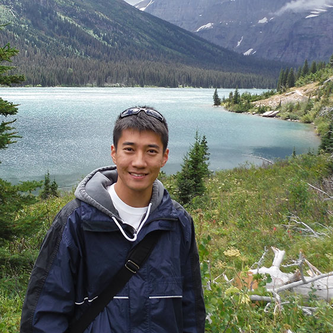

Latest update - `r format(Sys.time(), '%d %B, %Y')`

```{r, include = F}
knitr::opts_chunk$set(echo = F, message = F)
library(knitr)
```

### Current members

::: float-image
```{r out.width='200px', out.extra='style="float:left; padding:10px"', echo=FALSE}
knitr::include_graphics("image/img_ei.jpg")
```

**Ethan Isaac**, Ph.D student -- I was raised in Daytona Beach Florida where I grew a passion for wildlife and biology. After turning 18 I enlisted in the US Air Force and served for five years in Special Warfare as a Tactical Air Control Party operator. During this time, I had two kids, my daughter Elsa and my son Avi. After my service I decided to peruse higher education where I earned my BS in biology and a minor in chemistry here at UNCG! For fun I lift heavy, play outside with my kids, or play inside with my kids!
:::

::: float-image
```{r out.width='200px', out.extra='style="float:left; padding:10px"', echo=FALSE}
knitr::include_graphics("image/img_al.jpg")
```

**Ashley LaRoque**, Ph.D student -- Being from Minnesota, my love of freshwater started at a young age. I grew up never more than a half mile from a lake. This allowed me to explore aquatic ecology at a young age. As I dove deeper into my education at the University of Minnesota, I realized the importance of freshwater ecology and earned my Bachelor's degree in Ecology, Evolution, and Behavior. My previous research quantified how temperature change in lakes has impacted the phenology of spawning in freshwater fish. I also have experience on a stable isotope project looking at the impact of invasive species on predatory fish. As a Ph.D. student in Environmental Health Sciences at UNCG, my research revolves around stream ecology. I am working on a mark-recapture study using passive integrated transponder tags to understand fish behavior. Outside of my research in fisheries, I love to go fishing, cook, play with my cat Hudson, and go hiking.
:::

::: float-image
```{r out.width='200px', out.extra='style="float:left; padding:10px"', echo=FALSE}

```

**Dr. Timothy Lee**, Postdoc -- I am originally from Seoul, South Korea and raised in the Pacific Northwest, where I have acquired my long-standing fascination with aquatic ecosystems. Over the years, I have participated in many exciting projects across the world, including sampling demersal fishes in the Sea of Japan and surveying benthic macroinvertebrates in Oregon and Washington’s continental shelf habitats just to name a couple. In collaboration with researchers at the University of Washington and Washington Sea Grant, I also completed an assessment on coastal macroinvertebrate community responses to shoreline armoring removal in the Puget Sound’s coastlines. During my PhD, I completed a large-scale biogeographic study along the U.S. east coast to describe patterns of free-living and parasitic invertebrate communities associated with invasive alga Gracilaria vermiculophylla, and understanding prevalence of parasitic barnacles along salinity gradients in the Pamlico and Neuse Rivers of North Carolina. As a postdoctoral fellow in Dr. Terui’s lab, I am interested in determining which environmental predictors influence complex food web dynamics in riverine systems using quantitative approaches.
:::

::: float-image
```{r out.width='200px', out.extra='style="float:left; padding:10px"', echo=FALSE}
knitr::include_graphics("image/img_at.jpg")
```

**Dr. [Akira Terui](https://scholar.google.com/citations?user=H9OuCKsAAAAJ&hl=ja&authuser=1)**, PI -- I'm interested in spatial ecology in general. My research career started at the University of Tokyo where I studied metapopulation structure of the endagered freshwater mussel *Margaritifera laevis*. After obtaining Ph.D., my research interests expanded. Thus far, I studied freshwater mussels, fish, aquatic and terrestrial insects, plants, and seabirds in collaboration with excellent researchers across the globe. While my research spans across multiple taxa, all tied with a common thread - space. More recently, I started using mathematical approaches and try to integrate theoretical and field research. I'm a lover of streams, tennis, and programming in R. Small gardening became one of my hobbies during quarantine.
:::

### Former Lab Members

-   Shota Shibasaki, Postdoc (2022-2023) Current Position: Postdoc at National Institute of Genetics
-   Charles Wahl, Postdoc (2021-2023) Current Position: Ecologist at USGS
-   Seoghyn Kim, Postdoc (2020-2022) Current Position: Assistant Professor at Kangwon National University
-   Justin Pomeranz, Postdoc (2021) Current Position: Assistant Proefessor at Colorado Mesa University
-   Mason Ibrahim, Undergrad (Fall 2020 - Spring 2023)
-   Lucia Ramirez-Joseph, Undergrad (Spring 2021 - Spring 2022)

NOTE: Team members are alphabetically ordered
