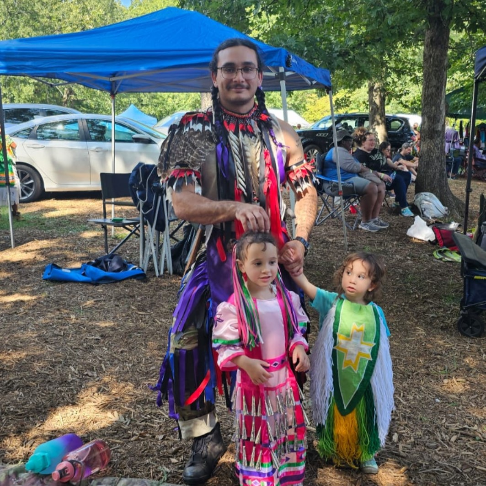
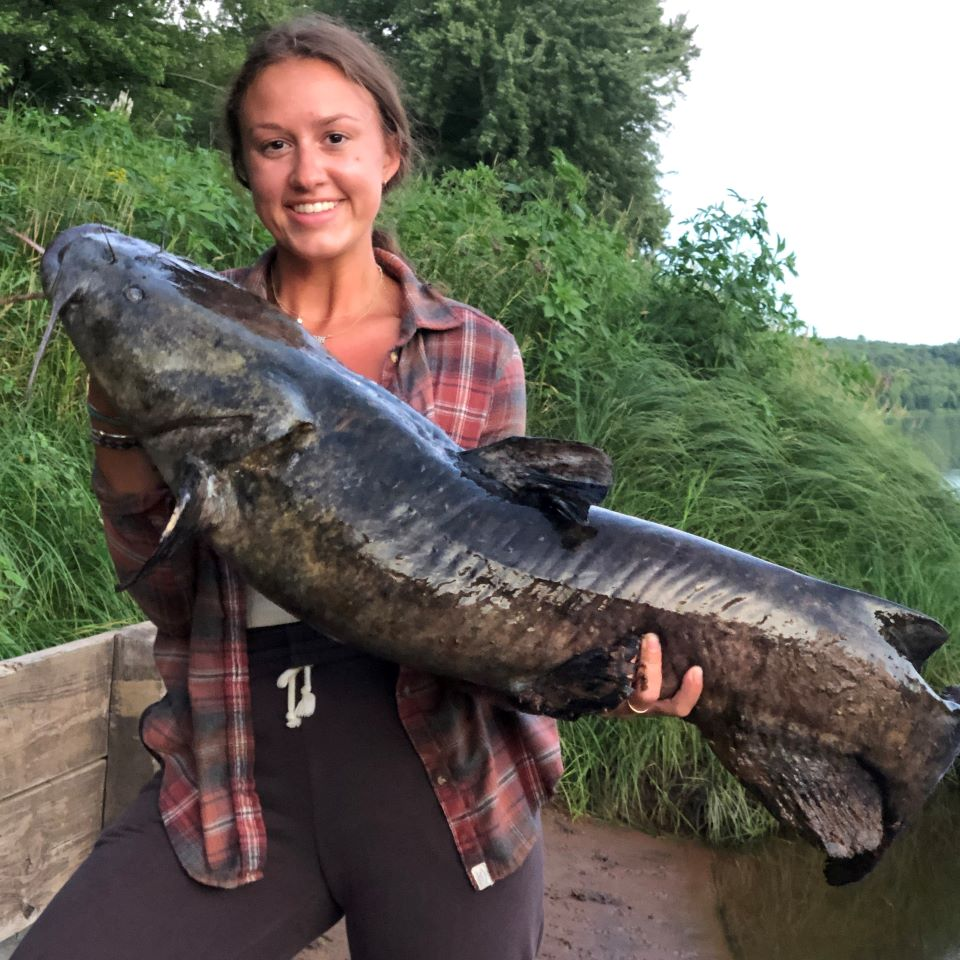
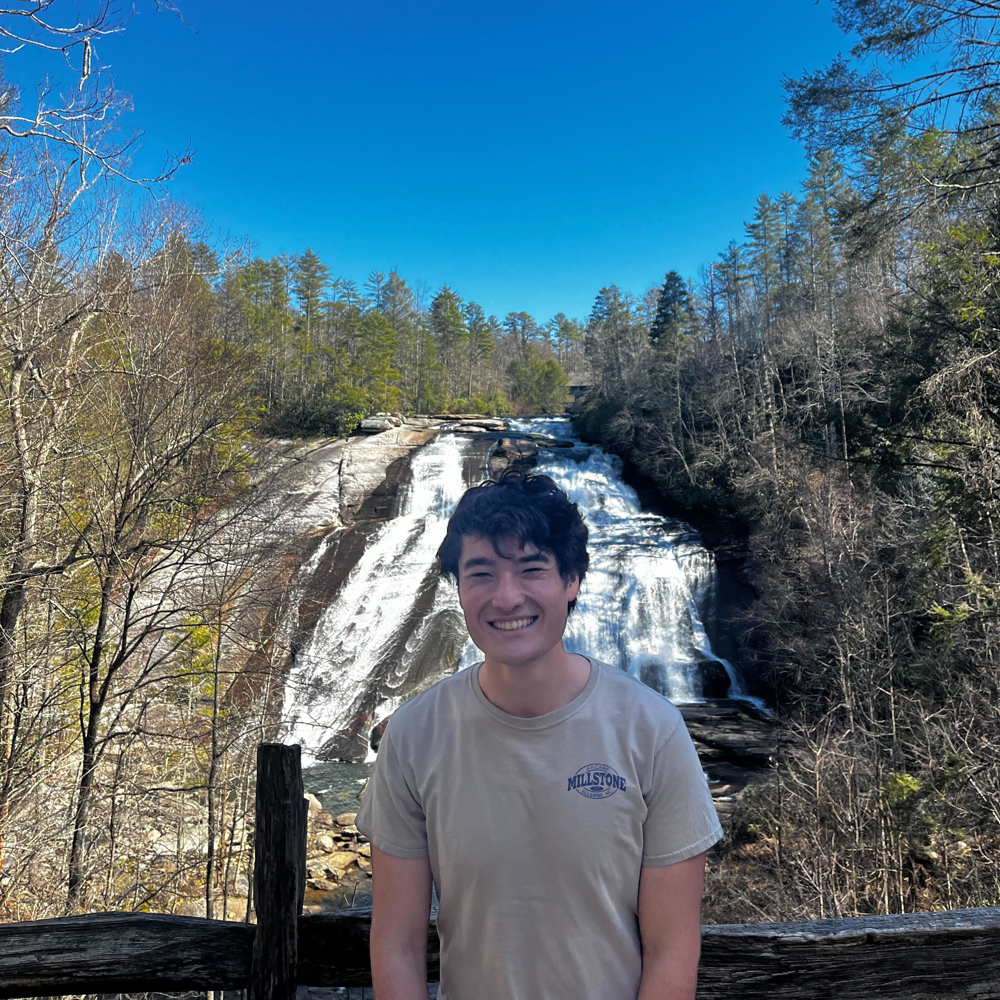

Latest update - `r format(Sys.time(), '%d %B, %Y')`

```{r, include = F}
knitr::opts_chunk$set(echo = F, message = F)
library(knitr)
```

### Current members

NOTE: Team members are ordered alphabetically

::: float-image
```{r out.width='200px', out.extra='style="float:left; padding:10px"', echo=FALSE}

```

**Ethan Isaac**, Ph.D student -- I was raised in Daytona Beach Florida where I grew a passion for wildlife and biology. After turning 18 I enlisted in the US Air Force and served for five years in Special Warfare as a Tactical Air Control Party operator. During this time, I had two kids, my daughter Elsa and my son Avi. After my service I decided to peruse higher education where I earned my BS in biology and a minor in chemistry here at UNCG! For fun I lift heavy, play outside with my kids, or play inside with my kids!
:::

::: float-image
```{r out.width='200px', out.extra='style="float:left; padding:10px"', echo=FALSE}

```

**Ashley LaRoque**, Ph.D candidate -- Being from Minnesota, my love of freshwater started at a young age. I grew up never more than a half mile from a lake. This allowed me to explore aquatic ecology at a young age. As I dove deeper into my education at the University of Minnesota, I realized the importance of freshwater ecology and earned my Bachelor's degree in Ecology, Evolution, and Behavior. My previous research quantified how temperature change in lakes has impacted the phenology of spawning in freshwater fish. I also have experience on a stable isotope project looking at the impact of invasive species on predatory fish. As a Ph.D. student in Environmental Health Sciences at UNCG, my research revolves around stream ecology. I am working on a mark-recapture study using passive integrated transponder tags to understand fish behavior. Outside of my research in fisheries, I love to go fishing, cook, play with my cat Hudson, and go hiking.
:::

::: float-image
```{r out.width='200px', out.extra='style="float:left; padding:10px"', echo=FALSE}

```

**Luc Lowry**, Undergraduate researcher -- Currently, I am an undergraduate student majoring in biology, with minors in chemistry and statistics. I plan to continue my education and pursue a career in ecology research. I enjoy learning about different topics in biology and math. Additionally, I have always had a strong interest in animals and nature, so I decided to pursue a career in these fields. In this lab, I aim to establish a solid foundation in research techniques and statistical analysis, enabling me to navigate graduate school and future career endeavors with greater ease. I am a fan of cats, hiking, and watching TV.
:::

::: float-image
```{r out.width='200px', out.extra='style="float:left; padding:10px"', echo=FALSE}
knitr::include_graphics("image/img_at.jpg")
```

**Dr. [Akira Terui](https://scholar.google.com/citations?user=H9OuCKsAAAAJ&hl=ja&authuser=1)**, PI -- I'm interested in spatial ecology in general. My research career started at the University of Tokyo where I studied metapopulation structure of the endangered freshwater mussel *Margaritifera laevis*. After obtaining Ph.D., my research interests expanded. Thus far, I studied freshwater mussels, fish, aquatic and terrestrial insects, plants, and seabirds in collaboration with excellent researchers across the globe. While my research spans across multiple taxa, all tied with a common thread - space. More recently, I started using mathematical approaches and try to integrate theoretical and field research. I'm a lover of streams, tennis, and programming in R. Small gardening became one of my hobbies during quarantine.
:::

### Alumni

```{r alumni}

# setup -------------------------------------------------------------------

rm(list = ls())
pacman::p_load(googledrive,
               tidyverse,
               reactable,
               reactablefmtr)


# download source data ----------------------------------------------------

drive_download("mentoring",
               type = "csv",
               path = "data/mentee.csv",
               overwrite = T)


# set table ---------------------------------------------------------------

df_mentee <- read_csv(here::here("data/mentee.csv")) %>% 
  filter(role == "primary",
         to != "present",
         from >= 2019) %>% 
  dplyr::select(name = mentee,
                role = type,
                from,
                to) %>% 
  mutate(role = str_to_sentence(role)) %>% 
  arrange(role,
          desc(from)) %>% 
  rename_with(.fn = str_to_sentence)

df_mentee %>% 
  reactable(searchable = TRUE,
            pagination = TRUE)

```
