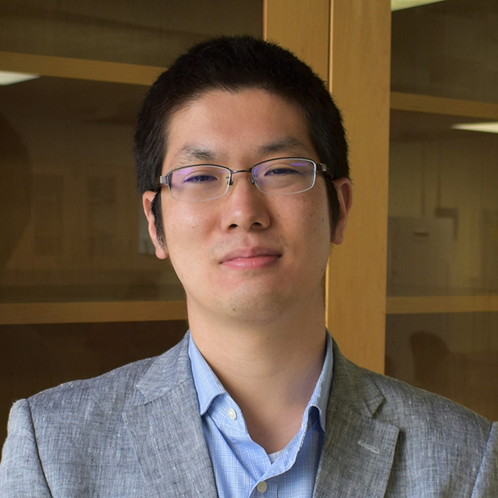

Latest update - `r format(Sys.time(), '%d %B, %Y')`

```{r, include = F}
knitr::opts_chunk$set(echo = F, message = F)
library(knitr)
```

### Current members

::: float-image
```{r out.width='200px', out.extra='style="float:left; padding:10px"', echo=FALSE}
knitr::include_graphics("image/img_al.jpg")
```

**Ashley LaRoque**, Ph.D student -- Being from Minnesota, my love of freshwater started at a young age. I grew up never more than a half mile from a lake. This allowed me to explore aquatic ecology at a young age. As I dove deeper into my education at the University of Minnesota, I realized the importance of freshwater ecology and earned my Bachelor's degree in Ecology, Evolution, and Behavior. My previous research quantified how temperature change in lakes has impacted the phenology of spawning in freshwater fish. I also have experience on a stable isotope project looking at the impact of invasive species on predatory fish. As a Ph.D. student in Environmental Health Sciences at UNCG, my research revolves around stream ecology. I am working on a mark-recapture study using passive integrated transponder tags to understand fish behavior. Outside of my research in fisheries, I love to go fishing, cook, play with my cat Hudson, and go hiking.
:::

::: float-image
```{r out.width='200px', out.extra='style="float:left; padding:10px"', echo=FALSE}

```

**Dr. Shota Shibasaki**, Postdoc -- Nature is very complex. When you go outside, you will see many species live together and each species affects others. This makes it very hard to understand and predict ecological dynamics. We cannot easily answer what makes many species coexist and what would happen when some fluctuations change population sizes. Mathematics help us to address such questions. My research interest is to understand and to control ecological systems using mathematics. During my Ph.D. in Switzerland, I proposed two mathematical frameworks to answer how we can maximize the benefits from microbial communities, including energy production and removal of toxic compounds, while controlling the dynamics of microbes. In Dr. Akira’s group, I analyze what determines the properties of food webs using mathematical models and statistics.
:::

::: float-image
```{r out.width='200px', out.extra='style="float:left; padding:10px"', echo=FALSE}
knitr::include_graphics("image/img_ms.jpg")
```

**Melanie Stadler**, Ph.D student -- I grew up in the middle of Kansas, with incredible parents who encouraged my love of nature and wanting to learn about the world around me. While earning a bachelor's degree in Biology from UNCG, I was introduced to the world of turtle and tortoise biology and conservation. I earned an MS in Biological Sciences and GIS certificate from Florida Atlantic University, studying the habitat and foraging ecology of juvenile green turtles on nearshore reefs in Florida. Prior to returning to North Carolina, I worked as a Sea Turtle Biologist in Florida for eight years where I supervised two nesting beach programs, participated in some amazing research projects, and managed the overhaul and daily operations of two sea turtle rehabilitation centers. I am interested in spatial ecology, ecological biogeography, and habitat connectivity, especially in turtles and other herp species. I am excited to be part of UNCG's Department of Biology, Environmental Health Science PhD program, and I plan to focus my PhD research on threatened bog turtles and their wetland habitat in North Carolina. I live with my husband, Brian, our bearded dragon, and two dog children in Greensboro. In my spare time, you will find me running or biking on one of our extraordinary local hiking trails, birdwatching, curled up with a good book, or in the kitchen experimenting with a new vegetarian recipe.
:::

::: float-image
```{r out.width='200px', out.extra='style="float:left; padding:10px"', echo=FALSE}
knitr::include_graphics("image/img_at.jpg")
```

**Dr. [Akira Terui](https://scholar.google.com/citations?user=H9OuCKsAAAAJ&hl=ja&authuser=1)**, PI -- I'm interested in spatial ecology in general. My research career started at the University of Tokyo where I studied metapopulation structure of the endagered freshwater mussel *Margaritifera laevis*. After obtaining Ph.D., my research interests expanded. Thus far, I studied freshwater mussels, fish, aquatic and terrestrial insects, plants, and seabirds in collaboration with excellent researchers across the globe. While my research spans across multiple taxa, all tied with a common thread - space. More recently, I started using mathematical approaches and try to integrate theoretical and field research. I'm a lover of streams, tennis, and programming in R. Small gardening became one of my hobbies during quarantine.
:::

### Former Lab Members

-   Charles Wahl, Postdoc (2021-2023) Current Position: USGA Ecologist
-   Seoghyn Kim, Postdoc (2020-2022) Current Position: Assistant Professor at Kangwon National University
-   Justin Pomeranz, Postdoc (2021) Current Position: Assistant Proefessor at Colorado Mesa University
-   Mason Ibrahim, Undergrad (Fall 2020 - Spring 2023)
-   Lucia Ramirez-Joseph, Undergrad (Spring 2021 - Spring 2022)

NOTE: Team members are alphabetically ordered
