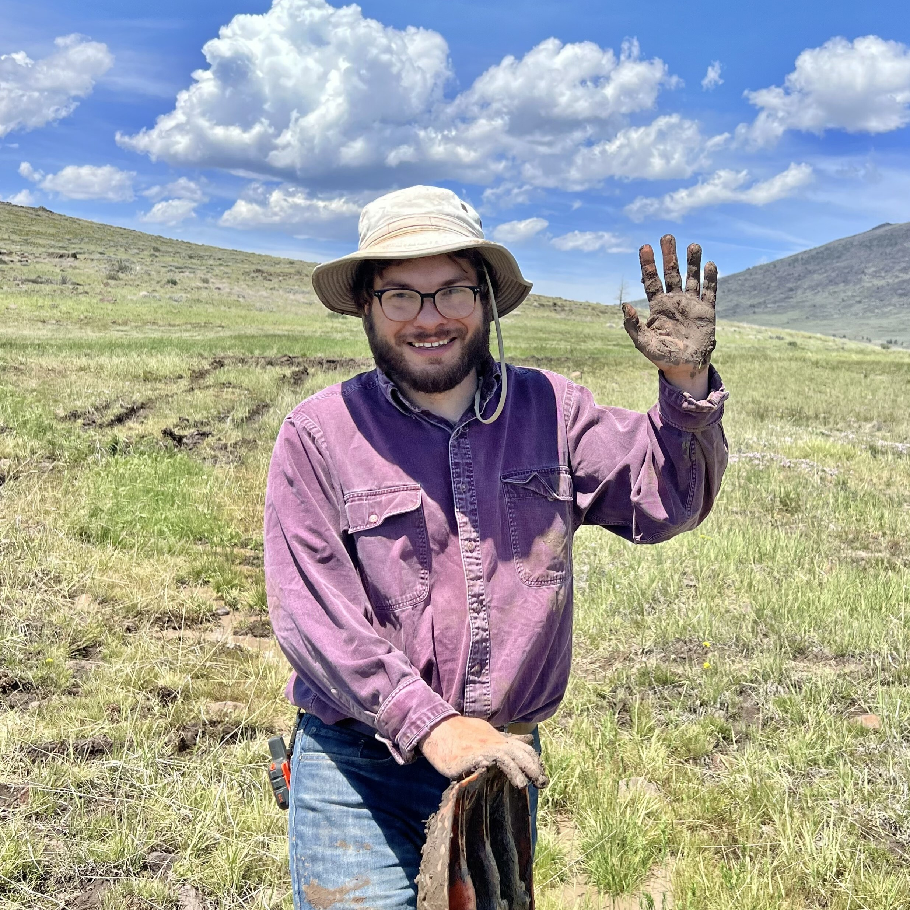

```{r, include = F}
knitr::opts_chunk$set(echo = F, message = F)
library(knitr)
```

### Current members

<div class="clearfix">

**Dr. Seoghyun Kim**, Postdoc [`r icon::fa("github")`](https://github.com/seoghyunkim/) [`r icon::fa("researchgate")`](https://www.researchgate.net/profile/Seoghyun_Kim)\

My research focuses on stream fish ecology and conservation using various techniques such as automated individual tracking techniques and genetic framework. I am interested in (1) how similar fish species co-exist in their sympatric areas, (2) effects of environmental stressors on fish community structure, and (3) how individual traits (e.g., behavior) affect reproductive success. My doctoral dissertation was to characterize reproductive ecology of nest-building stream fish (bluehead chub) and assess the effects of interactions among individuals and their variation on fitness consequences. As a postdoctoral fellow in Dr. Akira Terui’s lab, I am currently handling a huge dataset to understand impacts of various environmental factors on fish metacommunity. More information is in: https://seoghkim.weebly.com/
</div>
\

<div class="clearfix">

**Dr. Justin Pomeranz**, Postdoc [`r icon::fa("github")`](https://github.com/Jpomz)

I am a community ecologist with an interest in the structure and function of food webs. I completed my undergraduate and graduate work at Colorado State University, where I received a strong background in the taxonomy and morphology of insects (primarily aquatic insects, but some terrestrial work as well). I completed a Ph.D. at the University of Canterbury on the south island of New Zealand. My research was focused on stream food webs impacted by acid mine drainage. During my doctoral work, I took a quantitative and computational approach and discovered (to my never ending surprise) that I enjoy coding and programming in the R language. I am excited to join Dr. Terui's lab, where I will be developing models to predict food chain length in streams. In my free time, I enjoy climbing on rocks, running on mountain trails, and reading sci-fi and fantasy books.
</div>
\

<div class="clearfix">

**Melanie Stadler**, Ph.D. student [`r icon::fa("researchgate")`](https://www.researchgate.net/profile/Melanie_Stadler)

I grew up in the middle of Kansas, with incredible parents who encouraged my love of nature and wanting to learn about the world around me.  While earning a bachelor’s degree in Biology from UNCG, I was introduced to the world of turtle and tortoise biology and conservation.  I earned an MS in Biological Sciences and GIS certificate from Florida Atlantic University, studying the habitat and foraging ecology of juvenile green turtles on nearshore reefs in Florida.  Prior to returning to North Carolina, I worked as a Sea Turtle Biologist in Florida for eight years where I supervised two nesting beach programs, participated in some amazing research projects, and managed the overhaul and daily operations of two sea turtle rehabilitation centers.  I am interested in spatial ecology, ecological biogeography, and habitat connectivity, especially in turtles and other herp species.  I am excited to be part of UNCG’s Department of Biology, Environmental Health Science PhD program, and I plan to focus my PhD research on threatened bog turtles and their wetland habitat in North Carolina.  I live with my husband, Brian, our bearded dragon, and two dog children in Greensboro.  In my spare time, you will find me running or biking on one of our extraordinary local hiking trails, birdwatching, curled up with a good book, or in the kitchen experimenting with a new vegetarian recipe.
</div>
\

<div class="clearfix">

**Dr. Akira Terui**, PI [`r icon::fa("github")`](https://github.com/aterui/) [`r icon::fa("user-graduate")`](https://scholar.google.com/citations?user=H9OuCKsAAAAJ&hl=ja&authuser=1) 
[`r icon::fa("book")`](https://publons.com/researcher/1241876/akira-terui/)\

I'm interested in spatial ecology in general. My research career started at the University of Tokyo where I studied metapopulation structure of the endagered freshwater mussel *Margaritifera laevis*. After obtaining Ph.D., my research interests expanded. Thus far, I studied freshwater mussels, fish, aquatic and terrestrial insects, plants, and seabirds in collaboration with excellent researchers across the globe. While my research spans across multiple taxa, all tied with a common thread - space. More recently, I started using mathematical approaches and try to integrate theoretical and field research. I'm a lover of streams, tennis, and programming in R. Small gardening became one of my hobbies during quarantine.
</div>
\

### Undergraduate Students

- Kiersten Dery (Summer 2021 -)
- Aisha Hamoud (Summer 2021 -)
- Lucia Ramirez-Joseph (Spring 2021 -)
- Jessica Bribiesca (Spring 2021 -)
- Mason Ibrahim (Fall 2020 -)

### Former Undergraduate Students

- Zaria Bopp (Spring 2021)
- Jakayla Clyburn (Fall 2019 - Spring 2020)
- Kirsten Watson (Fall 2019)

NOTE: Team members are alphabetically ordered