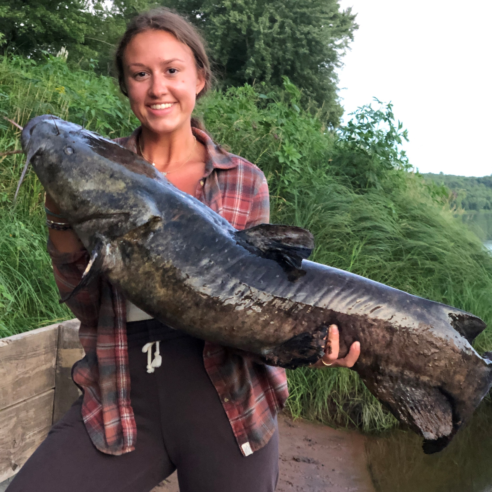

```{r, include = F}
knitr::opts_chunk$set(echo = F, message = F)
library(knitr)
```

### Current members

::: {.clearfix}
{align="left" style="vertical-align:top;" width="150"} **Dr. Seoghyun Kim**, Postdoc [`r icon::fa("github")`](https://github.com/seoghyunkim/) [`r icon::fa("researchgate")`](https://www.researchgate.net/profile/Seoghyun_Kim)\

My research focuses on stream fish ecology and conservation using various techniques such as automated individual tracking techniques and genetic framework. I am interested in (1) how similar fish species co-exist in their sympatric areas, (2) effects of environmental stressors on fish community structure, and (3) how individual traits (e.g., behavior) affect reproductive success. My doctoral dissertation was to characterize reproductive ecology of nest-building stream fish (bluehead chub) and assess the effects of interactions among individuals and their variation on fitness consequences. As a postdoctoral fellow in Dr. Akira Terui's lab, I am currently handling a huge dataset to understand impacts of various environmental factors on fish metacommunity. More information is in: <https://seoghkim.weebly.com/>
:::

\

::: {.clearfix}
{align="left" style="vertical-align:top;" width="150"} **Ashley LaRoque**, Ph.D student

Being from Minnesota, my love of freshwater started at a young age. I grew up never more than a half mile from a lake. This allowed me to explore aquatic ecology at a young age. As I dove deeper into my education at the University of Minnesota, I realized the importance of freshwater ecology and earned my Bachelor's degree in Ecology, Evolution, and Behavior. My previous research quantified how temperature change in lakes has impacted the phenology of spawning in freshwater fish. I also have experience on a stable isotope project looking at the impact of invasive species on predatory fish. As a Ph.D. student in Environmental Health Sciences at UNCG, my research revolves around stream ecology. I am working on a mark-recapture study using passive integrated transponder tags to understand fish behavior. Outside of my research in fisheries, I love to go fishing, cook, play with my cat Hudson, and go hiking.
:::

\

::: {.clearfix}
{align="left" style="vertical-align:top;" width="150"} **Melanie Stadler**, Ph.D. student [`r icon::fa("researchgate")`](https://www.researchgate.net/profile/Melanie_Stadler)

I grew up in the middle of Kansas, with incredible parents who encouraged my love of nature and wanting to learn about the world around me. While earning a bachelor's degree in Biology from UNCG, I was introduced to the world of turtle and tortoise biology and conservation. I earned an MS in Biological Sciences and GIS certificate from Florida Atlantic University, studying the habitat and foraging ecology of juvenile green turtles on nearshore reefs in Florida. Prior to returning to North Carolina, I worked as a Sea Turtle Biologist in Florida for eight years where I supervised two nesting beach programs, participated in some amazing research projects, and managed the overhaul and daily operations of two sea turtle rehabilitation centers. I am interested in spatial ecology, ecological biogeography, and habitat connectivity, especially in turtles and other herp species. I am excited to be part of UNCG's Department of Biology, Environmental Health Science PhD program, and I plan to focus my PhD research on threatened bog turtles and their wetland habitat in North Carolina. I live with my husband, Brian, our bearded dragon, and two dog children in Greensboro. In my spare time, you will find me running or biking on one of our extraordinary local hiking trails, birdwatching, curled up with a good book, or in the kitchen experimenting with a new vegetarian recipe.
:::

\

::: {.clearfix}
{align="left" style="vertical-align:top;" width="150"} **Dr. Akira Terui**, PI [`r icon::fa("github")`](https://github.com/aterui/) [`r icon::fa("user-graduate")`](https://scholar.google.com/citations?user=H9OuCKsAAAAJ&hl=ja&authuser=1) [`r icon::fa("book")`](https://publons.com/researcher/1241876/akira-terui/)\

I'm interested in spatial ecology in general. My research career started at the University of Tokyo where I studied metapopulation structure of the endagered freshwater mussel *Margaritifera laevis*. After obtaining Ph.D., my research interests expanded. Thus far, I studied freshwater mussels, fish, aquatic and terrestrial insects, plants, and seabirds in collaboration with excellent researchers across the globe. While my research spans across multiple taxa, all tied with a common thread - space. More recently, I started using mathematical approaches and try to integrate theoretical and field research. I'm a lover of streams, tennis, and programming in R. Small gardening became one of my hobbies during quarantine.
:::

\

::: {.clearfix}
{align="left" style="vertical-align:top;" width="150"} **Dr. Charles Wahl**, Postdoc\

My research focus is to understand processes that structure populations and communities in freshwater habitats with a focus on the role of anthropogenic disturbance. Human induced disturbances, such as the introduction of invasive species, habitat fragmentation and eutrophication, are becoming more prevalent. These impacts modify the local (habitat complexity and species interactions) and regional (dispersal) processes that structure ecosystems, resulting in changes to ecological state and altering the movement of energy through the system. I am also interested in how biological control can be used to reduce impacts from invasive species on ecosystem structure and function. Current research as a postdoc in Dr. Akira Terui’s lab involves using metapopulation theory to examine the population and spatial structure of an endangered fish species, topeka shiner (*Notropis topeka*), to guide restoration and conservation efforts.\
:::

### Undergraduate Students

-   Jessica Bribiesca (Spring 2021 -)
-   Aisha Hamoud (Summer 2021 -)
-   Mason Ibrahim (Fall 2020 -)
-   Lucia Ramirez-Joseph (Spring 2021 -)

### Former Lab Members

-   Justin Pomeranz, Postdoc (2021)
-   Kiersten Dery, Undergraduate (Summer 2021)
-   Zaria Bopp, Undergraduate (Spring 2021)
-   Jakayla Clyburn, Undergraduate (Fall 2019 - Spring 2020)
-   Kirsten Watson, Undergraduate (Fall 2019)

NOTE: Team members are alphabetically ordered
